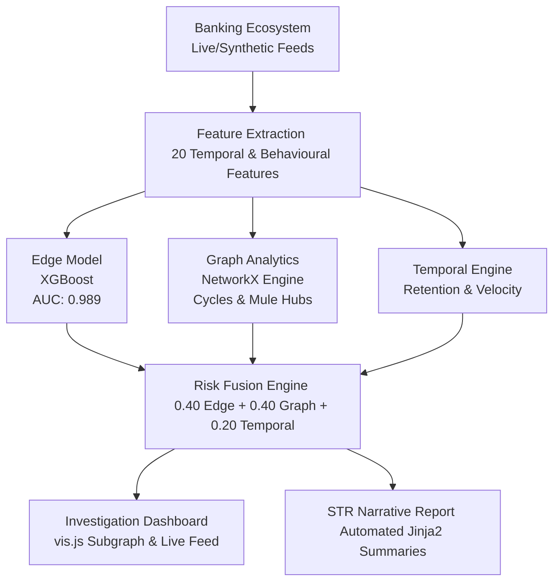

# GraphGuard v2
### Temporal Fund-Flow Intelligence Platform for Real-Time Fraud Detection

**PSBs Hackathon Series 2026 · Idea 2.0 · PS3: Tracking of Funds within Bank for Fraud Detection**  
**Union Bank of India · Team Kartavya · Somaiya Vidyavihar University**

---

## Table of Contents
1. [Problem Statement](#problem-statement)
2. [Solution Overview](#solution-overview)
3. [How to Run Locally](#how-to-run-locally)
4. [Libraries and Dependencies](#libraries-and-dependencies)
5. [Dataset](#dataset)
6. [Project Structure](#project-structure)
7. [API Reference](#api-reference)
8. [Known Limitations](#known-limitations)
9. [Team](#team)
10. [Submission Links](#submission-links)
11. [References](#references)

---

## Problem Statement
Indian Public Sector Banks process hundreds of millions of transactions daily across UPI, IMPS, NEFT, and RTGS channels. Fraud in this environment does not happen in isolated transactions — it happens across networks of coordinated accounts, deliberately structured to look ordinary at every individual step.

Three patterns that current tools systematically miss:

| Pattern | Description | Why It's Hard to Detect |
| :--- | :--- | :--- |
| **Circular Laundering** | Funds move A → B → C → A within 48–72 hours. | Each hop looks like a normal transfer. |
| **Dormant Mule Activation** | Account inactive 6–18 months suddenly receives large credit, disperses within minutes. | No single transaction breaches a threshold. |
| **Layering Cascade** | Funds move through 5–8 first-time beneficiaries in hours. | Origin untraceable by the time the last hop is flagged. |

Existing rule-based systems generate false positive rates as high as 94%. Batch analytics run overnight — funds are gone before detection. CBS dashboards show one account at a time; the fraud only exists in the graph.

GraphGuard addresses this by modelling the entire transaction network as a live, evolving graph and applying three independent intelligence layers to detect, visualise, and explain suspicious patterns in real time.

---

## Solution Overview
GraphGuard runs a five-stage pipeline on startup, then serves a live investigator dashboard:



### Execution Pipeline

```text
Banking Ecosystem (synthetic or live feed)
        ↓
Feature Extraction  (20 temporal + behavioural features)
        ↓
┌──────────────┬───────────────────┬────────────────────┐
│  Edge Model  │  Graph Analytics  │  Temporal Engine   │
│  XGBoost     │  NetworkX         │  Retention · Burst │
│  AUC: 0.989  │  Cycles · Chains  │  Velocity · Cascade│
└──────┬───────┴─────────┬─────────┴──────────┬─────────┘
       └─────────────────┼────────────────────┘
                         ↓
              Risk Fusion Engine
          0.40×Edge + 0.40×Graph + 0.20×Temporal
                         ↓
         Investigation Dashboard + STR Generation
```

Five fraud typologies detected: **Circular Laundering**, **Layering**, **Dormant Mule Activation**, **Structuring**, and **Hub-and-Spoke Mule Network**.

---

## How to Run Locally

### Prerequisites
- Python 3.11 or higher
- `pip`
- A modern browser (Chrome, Firefox, Edge)

> **Note**: No Docker, no Kafka, no external database, and no API keys are required.

### Step 1 — Clone the repository
```bash
git clone https://github.com/KUSH2005-IND/GraphGuardv2.git
cd GraphGuardv2
```

### Step 2 — Create a virtual environment (Recommended)
```bash
# Windows
python -m venv venv
venv\Scripts\activate

# macOS / Linux
python -m venv venv
source venv/bin/activate
```

### Step 3 — Install dependencies
```bash
pip install -r requirements.txt
```
*Installation takes approximately 2–3 minutes. No GPU required.*

### Step 4 — Start the application
```bash
python main.py
```

The terminal will show the full pipeline executing in sequence:
```text
============================================================
  GraphGuard v2 — Fraud Intelligence Platform
============================================================
[DataGen]      Generating 500 accounts...
[DataGen]      Generated 3720 legitimate transactions
[FraudInjector] Done. 247 fraud txns / 3967 total (6.2%)
[Features]     Extracted 20 features for 3967 transactions
[EdgeModel]    AUC-ROC: 0.9892, Recall: 0.9388
[GraphEngine]  Found 50 cycles, 127 mule hubs
[TemporalEngine] 21 accounts with elevated temporal risk
[RiskFusion]   9 alerts generated
============================================================
  ✓ Pipeline ready — open http://localhost:8000
============================================================
```
*Startup takes approximately 30–45 seconds on first run.*

### Step 5 — Open the dashboard
Navigate to **`http://localhost:8000`** in your browser.

The dashboard shows three panels:
* **Left** — Live Transaction Feed (WebSocket stream)
* **Centre** — Suspicious Subgraph (`vis.js` graph canvas)
* **Right** — Active Alert Queue (ranked by fused risk score)

Click any account in the alert queue to load its suspicious subgraph and investigation summary.

---

### Configuration
All pipeline parameters are in `config.py`. Key settings:

```python
# Data scale
NUM_ACCOUNTS = 500                  # increase for denser graph
NUM_LEGIT_TRANSACTIONS = 4500       # approximate target

# Graph analytics
MAX_CYCLE_LENGTH = 6                # maximum depth for cycle detection
SUBGRAPH_HOPS = 2                   # ego-subgraph radius
HUB_DEGREE_THRESHOLD = 10           # out-degree to flag as mule hub

# Risk thresholds
ALERT_THRESHOLDS = {
    "CRITICAL": 0.75,
    "HIGH":     0.55,
    "MEDIUM":   0.35,
    "LOW":      0.20,
}

# Fusion weights (must sum to 1.0)
FUSION_WEIGHTS = {
    "edge":     0.40,
    "graph":    0.40,
    "temporal": 0.20,
}
```

---

## Libraries and Dependencies
All dependencies are in `requirements.txt`. Exact versions used during development:

| Library | Version | Purpose |
| :--- | :--- | :--- |
| `fastapi` | 0.115.0 | Async web framework + REST API |
| `uvicorn[standard]` | 0.30.0 | ASGI server |
| `websockets` | 12.0 | WebSocket support for live feed |
| `xgboost` | 2.1.0 | Edge risk classification model |
| `scikit-learn` | 1.5.0 | Preprocessing, train/test split, metrics |
| `networkx` | 3.3 | Transaction graph construction + analytics |
| `python-louvain` | 0.16 | Community detection (Louvain algorithm) |
| `pandas` | 2.2.0 | Transaction dataframes + feature engineering |
| `numpy` | 1.26.4 | Numerical operations |
| `faker` | 28.0.0 | Synthetic account and name generation |
| `jinja2` | 3.1.4 | STR narrative template rendering |
| `python-multipart` | 0.0.9 | FastAPI form handling |

Install all at once:
```bash
pip install -r requirements.txt
```

### Frontend dependencies (CDN — no install required)
The frontend loads these via CDN in `frontend/index.html`:

| Library | Version | Purpose |
| :--- | :--- | :--- |
| `vis.js` | 9.1.2 | Graph network visualisation |

*No other external JS dependencies.*

---

## Dataset

### How synthetic data is generated
GraphGuard does not use real banking data. All data is generated at startup by `data/generator.py` using the `Faker` library.

The generator creates:
* **500 accounts** across 5 behavioural profiles: *salary earner, merchant, household, savings, dormant*
* **~3,700 legitimate transactions** over a simulated 90-day window
* **Indian banking attributes**: channels (UPI/IMPS/NEFT/RTGS), branch codes, KYC levels, rupee amounts

The `data/fraud_injector.py` then injects 16 fraud campaigns:

| Campaign Type | Count | Description |
| :--- | :--- | :--- |
| **CIRCULAR** | 3 | 3–5 node rings, 4 rounds each |
| **LAYERING** | 3 | 4–8 hop chains, 3 waves each |
| **DORMANT_MULE** | 3 | dormant account + redistribution burst |
| **STRUCTURING** | 4 | 8–20 sub-threshold transfers |
| **HUB_SPOKE** | 3 | hub account + 7–14 spoke recipients |

**Final dataset**: ~3,967 transactions, 6.2% labelled fraud, 116 accounts involved in fraud campaigns.

### To regenerate data with different parameters
Data is regenerated automatically every time `python main.py` is run. No manual step is required.

To change the scale:
```python
# In config.py
NUM_ACCOUNTS = 1000        # larger ecosystem
NUM_LEGIT_TRANSACTIONS = 10000
```
> [!WARNING]
> Increasing `NUM_ACCOUNTS` beyond 2,000 may cause the layering chain detection to slow significantly. See [Known Limitations](#known-limitations).

### Reference datasets (not used directly)
The fraud campaign design is informed by, but does not import from:
* **PaySim** — Kaggle — synthetic mobile money fraud dataset (Lopez-Rojas, 2016)
* **Elliptic Bitcoin Dataset** — Kaggle — temporal graph fraud benchmark

---

## Project Structure
```text
GraphGuardv2/
│
├── main.py                     # Application entry point (runs pipeline, serves FastAPI + WebSocket)
├── config.py                   # All tunable parameters in one place
├── requirements.txt            # Python dependencies (exact versions)
│
├── data/
│   ├── generator.py            # Banking ecosystem generator (accounts + legit txns)
│   └── fraud_injector.py       # Injects 16 labelled fraud campaigns
│
├── engine/
│   ├── features.py             # Feature extraction (20 features/transaction)
│   ├── edge_model.py           # XGBoost training + SHAP explainability
│   ├── graph_engine.py         # NetworkX graph + pattern detection
│   ├── temporal_engine.py      # Temporal signal computation per account
│   ├── risk_fusion.py          # Weighted fusion → unified score + alerts
│   ├── investigation.py        # Pattern classifier + STR narrative generator
│   └── templates/
│       ├── str_report.j2       # STR narrative Jinja2 template
│       └── investigation_summary.j2
│
├── frontend/
│   ├── index.html              # Dashboard layout
│   ├── styles.css              # Dark theme styling
│   └── app.js                  # vis.js graph + WebSocket + investigation UI
│
└── models/
    └── edge_model.pkl          # Saved XGBoost model (auto-generated on startup)
```

---

## API Reference
The backend exposes the following endpoints at `http://localhost:8000`:

| Method | Endpoint | Description |
| :--- | :--- | :--- |
| `GET` | `/` | Serves the investigation dashboard |
| `GET` | `/api/status` | Pipeline readiness check |
| `GET` | `/api/alerts` | Ranked alert queue (all flagged accounts) |
| `GET` | `/api/accounts/{account_id}` | Account profile + risk scores |
| `GET` | `/api/graph/{account_id}` | Suspicious subgraph (nodes + edges, capped at 15 nodes) |
| `GET` | `/api/investigation/{account_id}` | Full investigation: scores, patterns, STR narrative |
| `GET` | `/api/stats` | System-wide statistics and model metrics |
| `POST` | `/api/demo/scenario/{name}` | Inject a named demo scenario into the live feed |
| `WS` | `/ws/live` | WebSocket — streams live transactions at 500ms interval |

*Demo scenario names: `circular`, `layering`, `dormant_mule`, `structuring`, `hub_spoke`*

#### Examples:
```bash
# Trigger a mule network scenario
curl -X POST http://localhost:8000/api/demo/scenario/hub_spoke

# Get investigation for an account
curl http://localhost:8000/api/investigation/ACC1000242
```

---

## Known Limitations

1. **Graph scale — layering detection**
   The layering chain detection uses a bounded depth-first search on the top-30 highest-degree nodes. On graphs with more than 2,000 accounts, this can take 10–30 seconds.
   *Workaround*: Keep `NUM_ACCOUNTS` at 500–1,000 for prototype use. For production scale, replace NetworkX with Neo4j GDS and use Cypher-based path queries with index-backed traversal.

2. **Synthetic data only**
   The pipeline runs entirely on synthetically generated data. Real CBS transaction feeds require an ingestion adapter at the `data/` layer. The fraud pattern distributions in the synthetic data are representative but not calibrated against real PSB fraud rates.

3. **Community detection returns 0 results at small scale**
   The Louvain community detection algorithm requires sufficient graph density to form meaningful clusters. At 500 accounts, the graph is too sparse for reliable community segmentation. Results improve significantly above 2,000 accounts.

4. **No persistent storage**
   All pipeline state is held in-memory. Restarting `main.py` regenerates all data from scratch — alerts, scores, and investigation history are not persisted between sessions. A production deployment would add PostgreSQL for alert storage and an audit trail.

5. **STR narrative is template-driven, not LLM-generated by default**
   The investigation narrative uses Jinja2 templates branching on detected pattern type. This produces deterministic, reliable output but lacks the natural language variability of a live LLM. Optional Ollama/Mistral integration is supported but not enabled by default — no API key or GPU is required for the core system to function.

6. **Single-process architecture**
   The application runs as a single uvicorn process. Concurrent users accessing the same investigation data will share the same in-memory state. For multi-analyst deployments, the architecture should be extended with Redis caching and separate API/worker processes.

7. **vis.js performance ceiling**
   The graph canvas renders reliably up to 80–100 nodes. Subgraphs above this size are automatically capped at 60 nodes (highest-degree nodes retained). This is a frontend rendering constraint, not a graph analytics constraint.

---

## Team
**Team Kartavya** · *Somaiya Vidyavihar University* · Shortlisted Top 100, Idea 2.0

* **Kushagra Srivastava** (ML + Graph Lead) — Feature engineering, XGBoost model, graph analytics engine, temporal intelligence, risk fusion.
* **Khushi Jain** (Gen-AI + Investigation) — Pattern classifier, Jinja2 STR templates, investigation narrative engine.
* **Anuj Gope** (Backend + DevOps) — FastAPI pipeline, WebSocket streaming, API design, system integration.
* **Kanishka Tomar** (Frontend + Visualisation) — `vis.js` dashboard, graph canvas, investigation panel, live transaction feed.

---

## Submission Links

| Deliverable | Link |
| :--- | :--- |
| **D1 — Problem + Solution Brief** | [Google Doc] |
| **D2 — Working Prototype** | [https://github.com/KUSH2005-IND/GraphGuardv2](https://github.com/KUSH2005-IND/GraphGuardv2) |
| **D3 — Technical Architecture** | [Google Doc] |
| **D4 — Demo Video** | [YouTube Unlisted] |
| **D5a — Pitch Deck** | [Google Slides] |
| **D5b — Pitch Video** | [YouTube Unlisted] |

---

## References
1. Rossi, E. et al. *Temporal Graph Networks for Deep Learning on Dynamic Graphs*. NeurIPS 2020.
2. Lopez-Rojas, E.A. *PaySim: A Financial Mobile Money Simulator for Fraud Detection*. EMSS 2016.
3. RBI Master Direction on Fraud Risk Management in Commercial Banks. *Circular DOR.FSCO.REC.No.01/00.00.360/2024-25*, July 2024.
4. Liu, Y. et al. *Graph Neural Networks for Financial Fraud Detection: A Survey*. ACM Computing Surveys, 2023.
5. Lundberg, S. & Lee, S. *A Unified Approach to Interpreting Model Predictions (SHAP)*. NeurIPS 2017.
